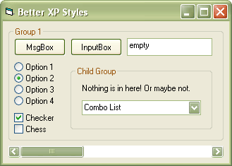



## Better XP Styles

### Description

In this new version, you don't have to carry an external XML file, which makes your app look unprofessional and you don't have to deal with all the resource files that you have to configure so accurately to make XP styles work. This is very simple and straight to the point. Enjoy!
 
### More Info
 

             |
---                |---
**Submitted On**   |2004-01-19 22:13:48
**By**             |[Hou Xiong](https://github.com/Planet-Source-Code/PSCIndex/blob/master/ByAuthor/hou-xiong.md)
**Level**          |Intermediate
**User Rating**    |4.2 (21 globes from 5 users)
**Compatibility**  |VB 6\.0
**Category**       |[Miscellaneous](https://github.com/Planet-Source-Code/PSCIndex/blob/master/ByCategory/miscellaneous__1-1.md)
**World**          |[Visual Basic](https://github.com/Planet-Source-Code/PSCIndex/blob/master/ByWorld/visual-basic.md)
**Archive File**   |[Better\_XP\_1696971192004\.zip](https://github.com/Planet-Source-Code/hou-xiong-better-xp-styles__1-51128/archive/master.zip)

